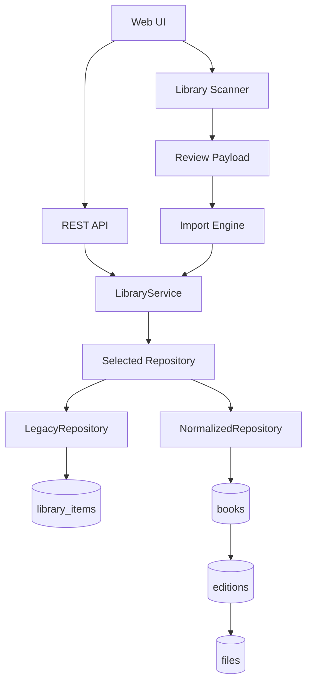

# Librarr

[](https://github.com/jamie75/librarr/actions/workflows/test.yml)
[](https://goreportcard.com/report/github.com/jamie75/librarr)
[](https://opensource.org/licenses/MIT)

**Self-hosted book acquisition, organization, cataloging, and OPDS delivery for homelabs.**

Librarr 2.0 is under active development. It is evolving from its Readarr roots
into a book-centric, Docker-first personal library application for ebooks,
audiobooks, comics, and manga.

Librarr began as a fork of the original Librarr project. Librarr 2.0 is now
independently maintained and has substantially diverged in architecture, user
experience, and roadmap. Original licensing and attribution are preserved; the
repository may remain in GitHub's fork network until the 2.0 detachment decision
is made.

The project is designed for hobby self-hosters in the same spirit as Jellyfin,
Audiobookshelf, Kavita, and Calibre-Web:

- polished UI
- intuitive onboarding
- minimal clicks
- sensible defaults
- responsive layouts
- API-first backend
- Docker-first deployment
- maintainable, reviewable PR-sized changes

Originally inspired by Readarr.

## Current Product State

Librarr 2.0 currently has:

- a normalized book-centric schema behind repository selection
- first-run administrator setup
- a redesigned Librarr 2.0 shell and simplified navigation
- Home onboarding for empty libraries
- a signed-in Home dashboard with recently added books, attention items,
  import/download status, library summary, and quick actions
- Library & Import settings with guided folder configuration
- recursive library scanning
- scan progress tracking
- scan review with summary cards, search, filters, and collapsible sections
- duplicate and already-imported detection
- manual-review detection and resolution controls
- explicit import actions from scan review results
- partial-failure reporting and retry of failed imports
- logical book cards that group available formats such as EPUB and MOBI
- safe library removal with separate catalog-only and delete-files actions
- embedded EPUB cover extraction with local cover caching
- expanded User Management with local accounts, roles, status, password resets, and invite codes
- rich connection diagnostics for Prowlarr and qBittorrent
- normalized `/api/v1` read endpoints
- OPDS 1.2 catalog browsing and downloads for compatible reader apps
- compatibility endpoints for existing legacy behavior
- optional Prowlarr and download-client integration

Unfinished UI scaffolding such as Devices, Activity, and send-to-device actions
is intentionally hidden until those features are real.

## Current Features

### First-run onboarding

The first-run workflow is:

1. Create the first administrator account.
2. Configure library folders.
3. Scan the existing library.
4. Review discovered books.
5. Explicitly import selected books.

After the first Library & Import save:

- `Save & Continue` disappears permanently.
- the standard Settings save action becomes authoritative.
- onboarding state survives reloads.
- Step 2 remains unlocked.

### Scanner

Scanning never imports files. It only discovers and classifies files.

The scanner currently supports:

- recursive folder scanning
- metadata extraction where available
- filename fallback
- duplicate detection
- already-imported detection
- manual-review detection
- progress tracking
- background scan jobs
- review payload generation
- inline metadata editing before import

Supported formats:

- ebooks: `epub`, `pdf`, `mobi`, `azw3`
- audiobooks: `m4b`, `mp3`
- manga/comics: `cbz`, `cbr`, `pdf`

Review classifications:

- Ready
- Duplicate
- Already Imported
- Manual Review
- Unsupported
- Unreadable

Representative real-world scan results during development were roughly:

- 29 files found
- 14 imported
- 13 duplicates
- 2 manual review

Treat those numbers as an example, not a benchmark or guarantee.

### Library management

In normalized Librarr 2.0 mode, the Library displays one card per logical book.
Available formats are shown as compact chips on the card and as individual files
in the details view. For example, a single book can show both `EPUB` and `MOBI`
without appearing as two separate books.

Book details provide two distinct admin actions:

- **Remove from Library** removes the normalized catalog record and leaves files
  untouched. Those files may return during a future scan.
- **Delete Book and Files** deletes the managed files attached to that book and
  then removes the catalog record. Librarr only deletes paths already associated
  with the selected book and only when they resolve inside configured library
  roots.
- **Merge Matching Duplicates** repairs historical split logical-book records
  when normalized title and contributor matching show they are the same book.

Librarr does not run automatic destructive repair on startup. Administrators can
explicitly repair historical duplicate rows from Book Details and can preview
the nested ebook path repair from Settings before any files are moved.

### Nested ebook path repair

Older development builds could create cataloged files under a repeated ebook
folder such as `/books/ebooks/ebooks/...`. Manual filesystem moves would break
Library and OPDS records because normalized file paths are stored in the
database.

Administrators can use **Settings → Maintenance → Repair Nested Ebook Paths**:

1. Merge matching duplicate books if needed.
2. Preview the nested ebook path repair.
3. Review ready, collision, missing, unsafe, and already-repaired entries.
4. Run the repair only after taking a backup.
5. Verify Library and OPDS.
6. Rescan only if needed.

The repair targets only the configured ebook root plus one repeated terminal
segment, for example `EbookDir=/books/ebooks` repairs
`/books/ebooks/ebooks/...` to `/books/ebooks/...`. It skips missing files,
collisions, unsafe paths, and unknown files that are not represented in the
catalog. Scanner imports from `/data/incoming` remain unmanaged/in-place until a
separate organization workflow is implemented.

### Review and import

Import is always explicit. Librarr does not automatically import after a scan.

The review UI supports:

- metadata editor for manual-review and ready candidates
- live destination folder, filename, and import-location preview
- validation for missing title/author, invalid year/ISBN, empty destinations, and duplicate filenames
- Save, Save & Import, Reset, and Cancel actions

The editor uses metadata already discovered during the scan. It does not perform
internet metadata lookup. EPUB files with embedded cover artwork are cached
locally and displayed during scan review, manual review, metadata editing,
Library, and book details. Unsupported formats or corrupt artwork continue to
use the colored placeholder.

The Library book-details Metadata Editor uses the same editing/validation
patterns for already-imported books and saves catalog metadata through
`PATCH /api/v1/books/{id}/metadata`. The current persisted fields are title,
edition title, subtitle, publisher, publication date/year, language,
description, and tags/genres. Author, series, ISBN, destination folder, and
filename are shown as context until those domain update paths are added.

### User management

Administrators can manage local accounts from Settings:

- view users, roles, enabled/disabled status, creation time, and last login
- create users directly without invite codes
- edit usernames and roles
- reset passwords
- disable or re-enable accounts
- delete non-admin users
- generate and revoke invite codes

Once users exist, the SQLite users table is authoritative. `AUTH_USERNAME` and
`AUTH_PASSWORD` are only used by the legacy zero-user authentication path, so
changing those Docker environment variables later does not rename or modify
existing database users.

- progress
- summary cards
- search
- filters
- collapsible sections
- destination preview
- duplicate details
- metadata source and confidence display
- `Use Suggested`
- `Edit Metadata`
- `Skip`

The import workflow supports:

- Select All
- Import Selected
- Import All Ready
- Skip Selected
- Clear Selection
- progress display
- completion summary
- automatic review refresh
- automatic library summary refresh
- duplicate exclusion
- partial failure reporting
- concurrent import protection
- retry failed imports without rescanning

Current manual-review limitations:

- no internet metadata lookup
- no cover downloading
- no provider-backed match search

### Search and downloads

Librarr can search configured sources and send downloads to supported clients.
Prowlarr and qBittorrent are optional integrations; Librarr can start, scan, and
manage a local library without them.

When using Docker networking, prefer service hostnames over IP addresses, for
example:

```text
http://prowlarr:9696
```

qBittorrent may be remote over HTTPS. Librarr fetches HTTP/HTTPS torrent files
from the configured Prowlarr origin itself and uploads torrent bytes to
qBittorrent; magnet links continue to use qBittorrent's URL submission path.

### Authentication

Fresh installations start with first-run setup. Librarr does not fabricate a
local admin session when the users table is empty.

The first created account becomes:

- administrator
- enabled
- authenticated

Existing installations with users continue through the normal login/session
flow.

## Planned Features

These are planned or in-progress and should not be treated as completed:

- richer metadata editor
- enhanced book details
- reading progress
- collections
- author management
- series management
- OPDS 2.0 improvements
- Kavita synchronization
- Audiobookshelf synchronization
- improved covers
- cover downloading
- send/download to device
- Kindle delivery
- scheduled scanning

## Project Direction

Librarr is not trying to become an enterprise architecture demo. The 2.0 work is
focused on a practical personal-library experience:

- one logical book can have multiple editions and formats
- files are physical representations of books
- matching is conservative
- ambiguous imports are reviewed instead of silently merged
- upgrades and migrations are deterministic and reversible
- errors should explain what failed, why, what was attempted, and what the user
  should do next
- unfinished features should be hidden instead of teased

## Librarr 2.0 Progress

- ✅ Vision
- ✅ Architecture
- ✅ Schema Foundation
- ✅ Domain Layer
- ✅ Repository Interfaces
- ✅ LibraryService
- ✅ Repository Switch
- ✅ Normalized Repository
- ✅ Migration Design
- ✅ Backfill Engine
- ✅ Import Planner
- ✅ Import Executor
- ✅ Import Engine Feature Flag
- ✅ First-run Setup
- ✅ Empty-library Onboarding
- ✅ Library Scanner
- ✅ Review UI
- ✅ Explicit Import from Review
- ✅ Manual Review Improvements
- ✅ Metadata Editor
- ✅ Connection Diagnostics for Prowlarr and qBittorrent
- ⬜ Metadata Provider Integration
- ⬜ Cover Improvements
- ✅ OPDS 1.2 Catalog
- ⬜ OPDS v2 / Delivery
- ⬜ Media Assistant Integration

## Connection Diagnostics

Prowlarr and qBittorrent diagnostics now run staged checks similar to Portainer
or Unraid:

```text
DNS               ✓
TCP               ✓
HTTPS             ✓
Authenticated     ✓
API Version       2.x
Latency           84 ms
```

Failure states should be equally specific:

```text
DNS               ✓
TCP               ✗
Timeout after 5 seconds
```

or:

```text
Connected
Authentication failed (401)
Check API key
```

Each step reports status, elapsed time where useful, detail text, and an
actionable suggestion. Future diagnostics should extend the same engine to
Audiobookshelf, Kavita, Komga, SABnzbd, and Transmission.

## Architecture Overview



Repository selection:

```text
LIBRARR_LIBRARY_REPOSITORY_MODE=legacy      # default
LIBRARR_LIBRARY_REPOSITORY_MODE=normalized  # Librarr 2.0 storage
```

Import engine selection:

```text
LIBRARR_IMPORT_ENGINE=legacy  # default
LIBRARR_IMPORT_ENGINE=v2      # planner + executor + normalized repository
```

## Docker Quick Start

Docker is the preferred deployment path.

```yaml
services:
  librarr:
    image: ghcr.io/jamie75/librarr:latest
    container_name: librarr
    restart: unless-stopped
    ports:
      - "5050:5050"
    volumes:
      - librarr-data:/data
      - /path/to/ebooks:/books/ebooks
      - /path/to/audiobooks:/books/audiobooks
      - /path/to/manga:/books/manga
      - /path/to/incoming:/data/incoming
    environment:
      LIBRARR_PORT: "5050"
      LIBRARR_DB_PATH: /data/librarr.db
      SETTINGS_FILE: /data/settings.json
      EBOOK_DIR: /books/ebooks
      AUDIOBOOK_DIR: /books/audiobooks
      MANGA_DIR: /books/manga
      INCOMING_DIR: /data/incoming
      PROWLARR_URL: http://prowlarr:9696
      QB_URL: https://qbittorrent.example.invalid
      # Remote paths as seen by qBittorrent. These are not Librarr's local
      # INCOMING_DIR staging paths unless both containers share the same path.
      QB_SAVE_PATH: /downloads
      QB_AUDIOBOOK_SAVE_PATH: /audiobooks-incoming
      QB_MANGA_SAVE_PATH: /manga-incoming
      QB_CATEGORY: librarr
      OIDC_PROXY_HEADERS_ENABLED: "false"
    networks:
      - homelab-media

volumes:
  librarr-data:

networks:
  homelab-media:
    external: true
```

Do not put secrets directly in committed compose files. Use Portainer secrets,
an `.env` file outside version control, or your deployment platform's secret
manager.

Start:

```bash
docker compose up -d
```

Open:

```text
http://localhost:5050
```

## Binary Quick Start

```bash
export LIBRARR_PORT=5050
export LIBRARR_DB_PATH=./librarr.db
export SETTINGS_FILE=./settings.json
export EBOOK_DIR=/books/ebooks
export AUDIOBOOK_DIR=/books/audiobooks
export MANGA_DIR=/books/manga
export INCOMING_DIR=/data/incoming

./librarr
```

Open `http://localhost:5050` and create the first administrator account.

## Configuration

All configuration is via environment variables and persisted settings. UI
settings can override startup defaults for Library & Import folders.

### Server

| Variable | Default | Description |
|---|---:|---|
| `LIBRARR_PORT` | `5050` | HTTP listen port |
| `LIBRARR_DB_PATH` | `/data/librarr.db` | SQLite database path |
| `SETTINGS_FILE` | `/data/settings.json` | Persistent settings file |

### Authentication

| Variable | Default | Description |
|---|---:|---|
| `API_KEY` | | Optional API key for programmatic access |
| `OIDC_ENABLED` | `false` | Enable OpenID Connect login |
| `OIDC_PROVIDER_NAME` | `SSO` | Login button label |
| `OIDC_ISSUER` | | OIDC issuer URL |
| `OIDC_CLIENT_ID` | | OAuth2 client ID |
| `OIDC_CLIENT_SECRET` | | OAuth2 client secret |
| `OIDC_REDIRECT_URI` | | Callback URL |
| `OIDC_AUTO_CREATE_USERS` | `true` | Auto-create users on first OIDC login |
| `OIDC_DEFAULT_ROLE` | `user` | Default role for OIDC-created users |
| `OIDC_PROXY_HEADERS_ENABLED` | `false` | Trust identity headers from a reverse proxy |

### Library and import folders

| Variable | Default | Description |
|---|---:|---|
| `EBOOK_DIR` | `/books/ebooks` | Ebook library folder as seen by Librarr |
| `AUDIOBOOK_DIR` | `/books/audiobooks` | Audiobook library folder as seen by Librarr |
| `MANGA_DIR` | `/books/manga` | Manga/comic library folder as seen by Librarr |
| `INCOMING_DIR` | `/data/incoming` | Import Folder / downloads staging path as seen by Librarr |
| `MANGA_INCOMING_DIR` | `/data/manga-incoming` | Manga incoming staging path |
| `FILE_ORG_ENABLED` | `true` | Organize imported files automatically |

For remote qBittorrent, `QB_SAVE_PATH` is the path as seen by qBittorrent.
`INCOMING_DIR` is the synchronized path as seen by Librarr. Librarr translates
completed torrent paths beneath `QB_SAVE_PATH` into `INCOMING_DIR` before
importing.

### Download clients

| Variable | Default | Description |
|---|---:|---|
| `TORRENT_CLIENT` | | Empty auto-selects qBittorrent when configured; otherwise `qbittorrent` or `transmission` |
| `QB_URL` | | qBittorrent Web UI URL |
| `QB_USER` | `admin` | qBittorrent username |
| `QB_PASS` | | qBittorrent password |
| `QB_SAVE_PATH` | `/downloads` | Ebook download path as seen by qBittorrent |
| `QB_CATEGORY` | `librarr` | qBittorrent category for ebooks |
| `QB_AUDIOBOOK_SAVE_PATH` | `/audiobooks-incoming` | Audiobook download path as seen by qBittorrent |
| `QB_AUDIOBOOK_CATEGORY` | `audiobooks` | qBittorrent category for audiobooks |
| `QB_MANGA_SAVE_PATH` | `/manga-incoming` | Manga download path as seen by qBittorrent |
| `QB_MANGA_CATEGORY` | `manga` | qBittorrent category for manga |
| `REMOVE_TORRENT_AFTER_IMPORT` | `true` | Remove torrent after successful import; set `false` to keep seeding |
| `TRANSMISSION_URL` | | Transmission RPC URL |
| `TRANSMISSION_USER` | | Transmission RPC username |
| `TRANSMISSION_PASS` | | Transmission RPC password |
| `SABNZBD_URL` | | SABnzbd URL |
| `SABNZBD_API_KEY` | | SABnzbd API key |
| `SABNZBD_CATEGORY` | `librarr` | NZB category |

### Prowlarr

| Variable | Default | Description |
|---|---:|---|
| `PROWLARR_URL` | | Prowlarr URL, preferably a Docker hostname such as `http://prowlarr:9696` |
| `PROWLARR_API_KEY` | | Prowlarr API key |

### Optional integrations

Librarr should function without these integrations. Configure them only when
you want those workflows.

| Variable | Description |
|---|---|
| `KAVITA_URL`, `KAVITA_USER`, `KAVITA_PASS` | Optional Kavita integration |
| `ABS_URL`, `ABS_TOKEN`, `ABS_LIBRARY_ID` | Optional Audiobookshelf integration |
| `KOMGA_URL`, `KOMGA_USER`, `KOMGA_PASS` | Optional Komga integration |
| `CALIBRE_LIBRARY_PATH`, `CALIBRE_URL` | Optional Calibre / Calibre-Web integration |

### Sources registry

Librarr loads search-source endpoint definitions from a small JSON registry at
startup. See [docs/source-registry.md](docs/source-registry.md) for dependency
details, override options, and offline behavior.

| Variable | Description |
|---|---|
| `LIBRARR_SOURCES_URL` | URL of a JSON sources registry |
| `LIBRARR_SOURCES_PATH` | Local sources registry JSON path; takes precedence over URL |

### Feature flags

| Variable | Default | Description |
|---|---:|---|
| `LIBRARR_LIBRARY_REPOSITORY_MODE` | `legacy` | `legacy` or `normalized` |
| `LIBRARR_IMPORT_ENGINE` | `legacy` | `legacy` or `v2` |
| `METRICS_ENABLED` | `true` | Enable Prometheus metrics |
| `WISHLIST_CLEANUP_ENABLED` | `false` | Conservative wishlist cleanup task |
| `WISHLIST_CLEANUP_DRY_RUN` | `true` | Log cleanup matches without deleting |

## API

Prefer Librarr 2.0 endpoints for new integrations.

### Librarr 2.0 read API

| Method | Path | Description |
|---|---|---|
| GET | `/api/v1/library/summary` | Normalized library totals |
| GET | `/api/v1/books` | List logical books |
| GET | `/api/v1/books/{id}` | Book details |
| GET | `/api/v1/books/{id}/files` | Files for a book |
| GET | `/api/v1/books/{id}/editions` | Editions for a book |
| GET | `/api/v1/books/{id}/cover` | Stored local book cover |
| GET | `/api/v1/books/{id}/metadata` | Effective metadata |
| PATCH | `/api/v1/books/{id}/metadata` | Partial metadata update |
| GET | `/api/v1/books/{id}/provenance` | Metadata provenance |

### Scanner, review, and import

| Method | Path | Description |
|---|---|---|
| POST | `/api/v1/library/scan` | Start a scan job |
| GET | `/api/v1/library/scan/{id}` | Scan job progress |
| GET | `/api/v1/library/scan/{id}/cover/{candidate_id}` | Temporary local scan-review cover |
| GET | `/api/v1/library/scan/{id}/results` | Completed review payload |
| POST | `/api/v1/library/scan/{id}/resolve` | Resolve or edit a review candidate before import |
| POST | `/api/v1/library/import` | Start explicit import from scan results |
| GET | `/api/v1/library/import/{id}` | Import job progress |
| GET | `/api/v1/library/import/{id}/results` | Import completion results |

### OPDS catalog

Librarr exposes an OPDS 1.2 catalog for compatible ebook reader apps on:

```text
https://your-librarr.example.com/opds
```

Use the same Librarr username and password you use for the web app. OPDS
endpoints use HTTP Basic authentication because many reader apps cannot use the
browser session-login flow. API-key access remains available for scripted
clients, but generated catalog URLs never include credentials.

The catalog includes:

- root navigation
- all books
- recently added books
- authors
- search
- cover links when Librarr already has a local cached cover
- one acquisition/download link for each available file format

Format behavior:

- EPUB and PDF are offered with standard reader-friendly MIME types.
- MOBI and AZW3 are offered as raw downloads when present.
- CBZ, CBR, MP3, and M4B may be listed for compatible clients, but Librarr does
  not claim universal iOS reader support for those formats.

Use HTTPS when exposing OPDS outside your local network. Apple Books itself is
not an OPDS catalog client; install an OPDS-compatible reader app and add the
`/opds` URL there. Reading progress sync, annotations, highlights, bookmarks,
format conversion, and send-to-device workflows are not implemented yet.

### Compatibility APIs

These routes still exist for legacy UI behavior, old clients, and transition
work. Do not treat them as the preferred long-term domain model.

| Method | Path | Description |
|---|---|---|
| GET | `/api/library` | Compatibility ebook library list |
| GET | `/api/library/audiobooks` | Compatibility audiobook list |
| GET | `/api/library/manga` | Compatibility manga list |
| GET | `/api/stats` | Compatibility stats |
| POST | `/api/import/scan` | Legacy manual-import scan |
| POST | `/api/import/files` | Legacy manual-import execution |
| POST | `/api/import/csv` | CSV import |
| GET | `/api/search` | Search ebooks |
| GET | `/api/search/audiobooks` | Search audiobooks |
| GET | `/api/search/manga` | Search manga |
| POST | `/api/download` | Direct download |
| POST | `/api/download/torrent` | Torrent download |
| GET | `/api/downloads` | Download jobs |
| GET | `/api/settings` | Settings |
| POST | `/api/settings` | Save settings |
| GET | `/api/config` | Bootstrap config |
| GET | `/api/health` | Health check |

## UX Principles

Home should be simple, minimal, and guiding. Settings sections own their own
save behavior. The scanner workflow should be:

```text
Scan → Review → Import → Done
```

Import is always explicit.

Errors should explain:

- what failed
- why it failed when known
- what Librarr attempted
- what the user should do next

Avoid generic "Something went wrong" messages.

## Documentation Map

- [VISION.md](VISION.md) — product direction
- [ARCHITECTURE.md](ARCHITECTURE.md) — target architecture and boundaries
- [ROADMAP.md](ROADMAP.md) — milestone tracking and next work
- [ACKNOWLEDGMENTS.md](ACKNOWLEDGMENTS.md) — origin and attribution
- [CHANGELOG.md](CHANGELOG.md) — release history
- [docs/releasing.md](docs/releasing.md) — release and Docker image process
- [docs/INDEPENDENCE_READINESS.md](docs/INDEPENDENCE_READINESS.md) — fork-detachment readiness
- [docs/source-registry.md](docs/source-registry.md) — source-definition dependency and override behavior
- [docs/library-scanner-phase1.md](docs/library-scanner-phase1.md) — scanner, review, and import workflow
- [docs/read-api.md](docs/read-api.md) — normalized read API
- [docs/v2-dogfood.md](docs/v2-dogfood.md) — local Librarr 2.0 dogfood deployment
- [docs/backfill-design.md](docs/backfill-design.md) and [docs/backfill-engine.md](docs/backfill-engine.md) — migration/backfill design

## Development

```bash
go test ./...
go vet ./...
node --check web/static/js/app.js
node --test web/static/js/app.test.js
```

See [CONTRIBUTING.md](CONTRIBUTING.md) for contribution expectations.
